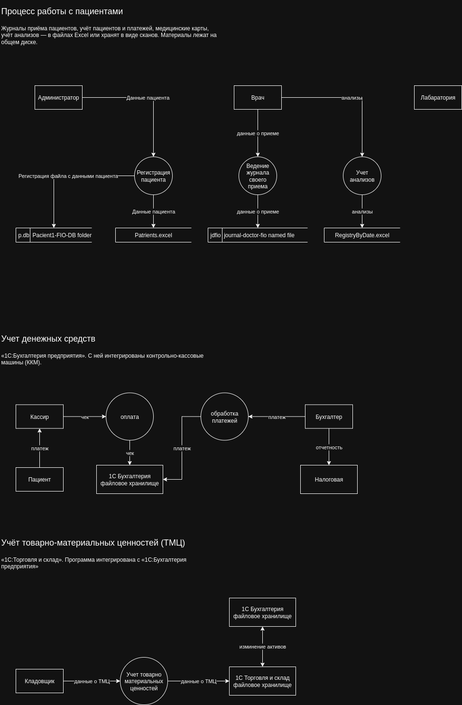

# Задание 1: Анализ безопасности системы

## 1. Выявите конфиденциальные данные, которые не учтены во внутренних системах.

тут ссылка на диаграммы (Physical data flow diagrams больше подходит т.к. надо отобразить работу с файлами)

 

## 2. Проведите аудит мер по обеспечению безопасности данных.

Ссылка на документ [аудит мер безопасности](audit-data-security.md)

## 3. Подумайте, что можно улучшить.

### список сопоставление данных для защиты и методов защиты - шифрование, обсуфскация, обезличивание

| Данные                    | Методы защиты | 
|---------------------------|---------------|
| Персональные данные (PII) | Обезличивание | 
| Медицинские данные        | Токенизация   | 
| Платежные данные          | Маскировка    |     

### механизм тергетирования данных, с помощью инструментов тергетирования

D данный момент система не готова к внедрению широко используемый инструментов типа Apache Atlas или Data Grail,
т.к. хранит данные просто в файлах. Но с учетом того, что будет разрабатываться система, в ее работу предполагается только на территории РФ,
и компания в свою очередь не является крупной, DataGrail, выглядит более подходящим решением

### Cписок инструментов, способов и мер которые позволят обеспечить конфиденциальность

Список инструментов и методов

- Управление идентификацией и правами доступа
  - Keycloak, RBAC/ABAC
- Шифрование данных
  - Шифрование на уровне дисков, в состоянии покоя
  - Шифрование при передаче данных в TLS 1.3
- Логирование и аудирование данных
  - ELK
- Защита от утечек
  - DLP (например McAfee DLP)